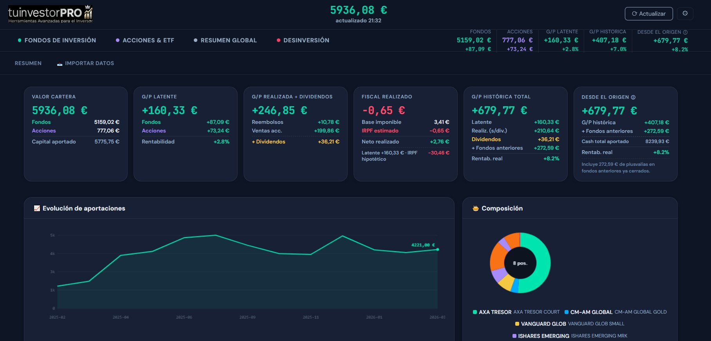
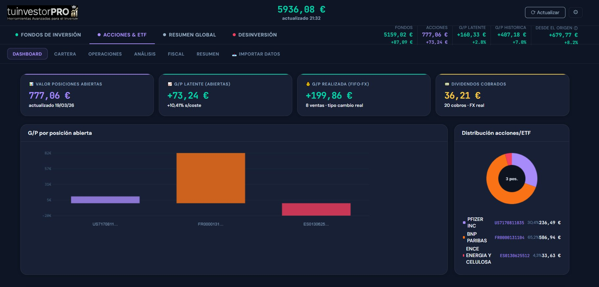

# tuinvestorPRO 📈

**Herramientas Avanzadas para el Inversor**

Aplicación web de gestión de cartera de inversión personal, diseñada para inversores con fondos de inversión y acciones/ETF en Inversis.

---

## ✨ Características

### Fondos de Inversión
- **Dashboard** — Gráfico de rendimiento por fondo vs benchmark, tarta de distribución, precios NAV en tiempo real
- **Cartera** — Posiciones actuales con G/P vs coste adquisición y vs cash real aportado, columnas de rendimiento 1W/1M/3M/1Y, configuración de Yahoo Tickers
- **Operaciones** — Historial completo con filtros, ordenación, parser automático de emails de Inversis
- **Análisis** — G/P latente por posición, ranking de rentabilidad, desglose histórico total
- **Fiscal** — Reembolsos FIFO con IRPF correcto, traspasos (coste heredado), plusvalías por año
- **Rebalanceo** — Calculadora de aportación óptima con universo personalizable
- **🔥 FIRE** — Simulador de independencia financiera con 6 escenarios, FIRE anticipado, herencia

### Acciones & ETF
- **Dashboard** — G/P por posición, tarta de distribución, dividendos cobrados
- **Cartera** — Posiciones con coste FIFO corregido por FX real, posiciones cerradas
- **Operaciones** — Formulario con soporte multi-divisa (USD/GBP/CHF), badge FX pendiente
- **Análisis** — Desglose total por activo (realizado + dividendos + latente), gráfico de dividendos
- **Fiscal** — G/P FIFO por venta, base imponible anual, IRPF estimado correcto

### Resumen Global
- KPIs consolidados (valor, G/P latente, realizada, fiscal YTD, histórico total, desde el origen)
- Gráfico de evolución de aportaciones con tooltip hover
- Desglose por activo con ordenación
- Panel fiscal con base imponible real y simulación hipotética

### Desinversión
- **Optimizador** — Plan de venta fiscalmente óptimo (FIFO, tramos IRPF, minusvalías primero)
- **Metas de ahorro** — Proyección para gastos futuros (universidad, etc.)
- **Jubilación & Herencia** — Simulación año a año con inflación, tasa de retiro, step-up fiscal

---


## 📸 Capturas

**Resumen Global — KPIs consolidados, evolución patrimonial y composición**


**Acciones & ETF — Dashboard con G/P por posición y distribución**


## 🗂️ Estructura de ficheros

```
tuinvestorpro/
├── index.html          # Interfaz principal (SPA)
├── movil.html          # Versión móvil optimizada (responsive, auto-refresh)
├── portafolio.js       # Lógica completa (~6000 líneas)
├── guardar.php         # API backend (operaciones CRUD, reset, importación)
├── precio.php          # Proxy Yahoo Finance / FT (precios NAV y cotizaciones)
├── data.json           # Base de datos (NO subir con datos reales)
├── logo.png            # Logo de la aplicación
├── .gitignore          # Excluye data.json con datos reales y backups
└── README.md           # Este fichero
```

---

## 🚀 Instalación

### Requisitos
- Servidor web con **PHP 8.x**
- Acceso a internet (para obtener precios de Yahoo Finance y FT)
- Navegador moderno (Chrome, Firefox, Safari, Edge)

### Pasos
1. Clona o descarga el repositorio
2. Sube todos los ficheros a tu servidor web (ej: `/public_html/tuinvestor/`)
3. Da permisos de escritura a `data.json`:
   ```bash
   chmod 664 data.json
   chown www-data:www-data data.json
   ```
4. Accede desde el navegador: `https://tudominio.com/tuinvestor/`
5. Credenciales por defecto: **`tuinvestor` / `12345678`**
6. **Cambia la contraseña inmediatamente** desde ⚙ → Configuración

---

## 🔐 Seguridad

- Autenticación por hash SHA-256 almacenado en `data.json`
- Cambio de credenciales desde la propia interfaz
- `data.json` **nunca debe ser público** — añade protección en `.htaccess` si es necesario:
  ```apache
  <Files "data.json">
      Require all denied
  </Files>
  ```
- Los backups (`.bak`) se generan automáticamente antes de cada reset — elimínalos periódicamente

---

## 📥 Importación de datos

### Desde Inversis (XLS)
1. En Inversis: **Mi cartera → Movimientos → Exportar → Excel (.XLS)**
2. En la app: **Resumen Global → Importar datos**
3. Las operaciones ya existentes se omiten automáticamente (deduplicación por referencia)
4. Las operaciones en divisa extranjera (USD, GBP) se marcan con ⚠ FX para verificar el tipo de cambio real

### Parser de emails Inversis
En **Fondos → Operaciones** hay un parser que lee emails de confirmación de Inversis y rellena el formulario automáticamente. Soporta suscripciones, reembolsos y traspasos.

---

## ⚙️ Configuración de precios

Cada fondo necesita un **Yahoo Ticker** para obtener el NAV actualizado:

1. Ve a **Fondos → Cartera** → panel ⚙ Yahoo Tickers (al final de la página)
2. Introduce el símbolo Yahoo para cada fondo (ej: `0P0001XF40.F`)
3. Usa el botón 🔍 para buscar automáticamente por ISIN
4. Pulsa 💾 para guardar

Para acciones, el ticker Yahoo se configura en **Acciones → Cartera** → mismo panel.

---

## 🛠️ Tecnología

- **Frontend**: HTML5 + CSS3 + JavaScript ES5 (vanilla, sin dependencias)
- **Backend**: PHP 8.x (un solo fichero `guardar.php`)
- **Datos**: JSON plano (`data.json`) — sin base de datos
- **Precios**: Yahoo Finance API + Financial Times (fallback)
- **Charts**: Canvas 2D nativo (sin librerías de gráficos)

---

## 📝 Notas importantes

- `data.json` es la única base de datos — **haz copias de seguridad regularmente**
- El servidor hace backup automático antes de cada reset (ficheros `.bak`)
- Los precios se actualizan pulsando **Actualizar** en la cabecera
- Los traspasos entre fondos son fiscalmente neutros (coste heredado automáticamente)
- El cálculo FIFO para acciones usa el tipo de cambio real del broker (campo `fx_aplicado`)

---

## 📄 Licencia

Uso personal. No redistribuir sin permiso del autor.
